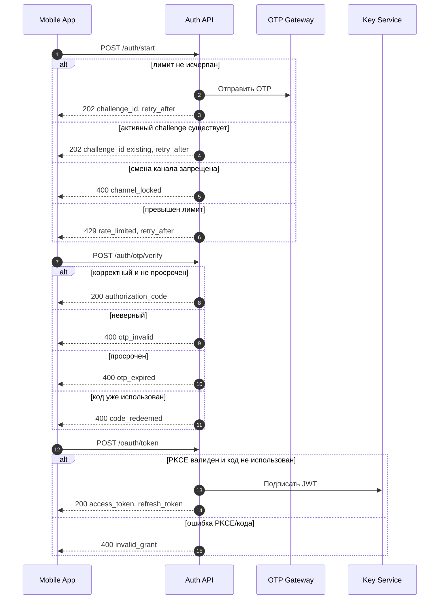
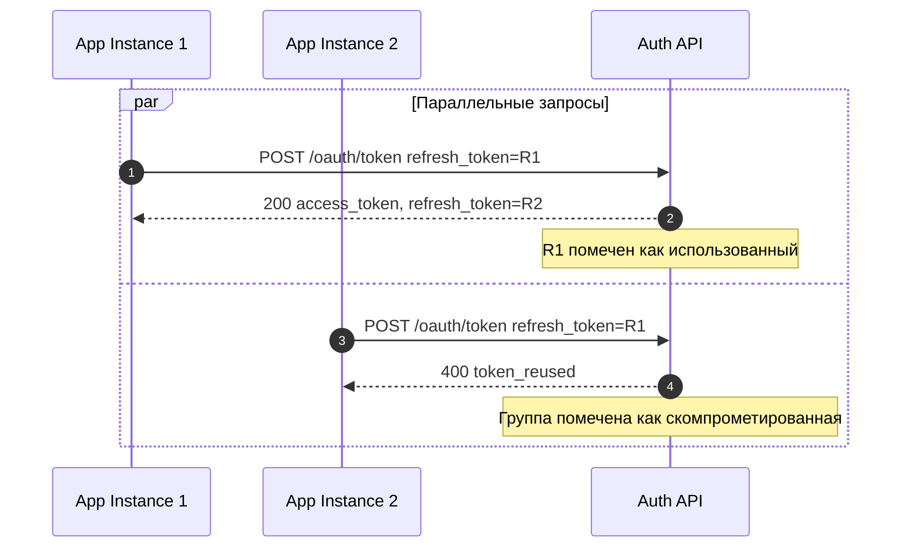
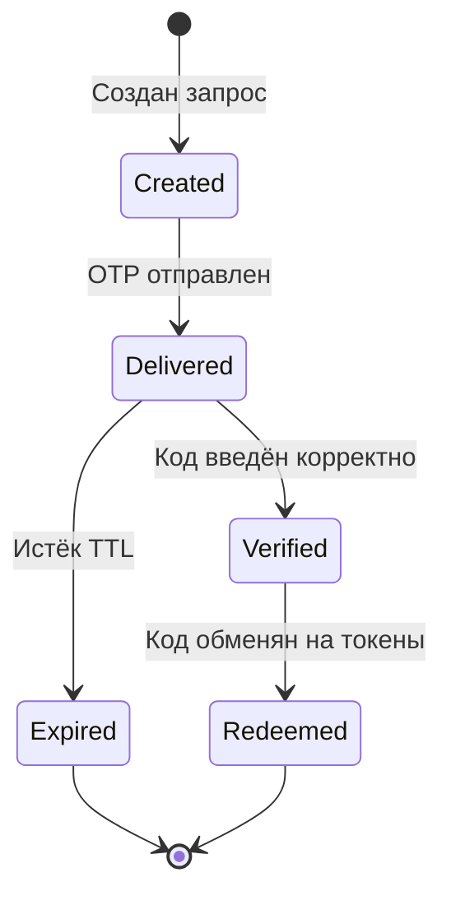
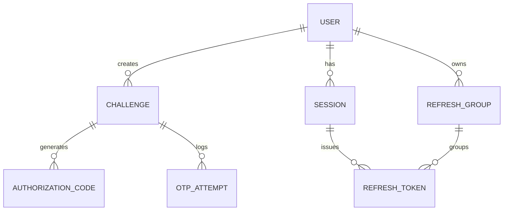

---
spec:
  version: 0.1
  status: Draft
  owner: System Analyst
  date: 2025-08-22
---

# Auth & 2FA OTP API — Product & System Spec

## Summary

**Цель:** Обеспечить безопасную двухфакторную аутентификацию пользователей мобильного приложения с использованием OTP-кодов и выдачей JWT-токенов.

**Что включает:**

- Запуск процесса аутентификации и отправка OTP.
- Верификация OTP-кода и выдача авторизационного кода.
- Обмен авторизационного кода на access/refresh токены.
- Ротация refresh-токенов с защитой от повторного использования.
- Локальный и глобальный выход из системы.
- Публикация ключей для верификации JWT (JWKS).

**Что НЕ включает:** социальные логины, web-SSO, процедуры KYC.

**Архитектурные решения:**

- OAuth 2.1 с Authorization Code flow + PKCE (S256).
- JWT-токены с подписью ES256/Ed25519, обязательный `kid`, запрет `alg="none"`.
- Refresh Token Rotation с детекцией повторного использования.
- Опциональный DPoP (привязка токенов к устройству).

**Критерии готовности:** реализованы и покрыты тестами пользовательские сценарии; полная OpenAPI 3.1 спецификация (примеры, схемы ошибок); обработаны негативные сценарии и защита от злоупотреблений; настроены мониторинг, метрики и аудит.

---

## 1. Контекст и цели

### Целевая аудитория

Пользователи мобильного кошелька на iOS и Android.

### Ключевые метрики (KPI)

1. Конверсия авторизации (успешные / все попытки).
2. Время получения токена (start → access_token).
3. Качество OTP (доля `otp_invalid` / `otp_expired`).
4. Частота повторных запросов OTP.

### Политики OTP

- Одноразовые коды: 6-значные числовые.
- Время жизни: 3 минуты (180 секунд).
- Защита от злоупотреблений: лимиты на попытки и повторные отправки.
- Временные блокировки при превышении лимитов.

### Внешние зависимости

- OTP-провайдеры: SMS-шлюз и **почтовый шлюз (email)** для доставки кодов.
- Локализация: многоязычные сообщения об ошибках.
- Аудит: система логирования и мониторинга безопасности.

---

## 2. Термины и определения

**Группа токенов обновления (Refresh Token Group)** — логически связанный набор refresh-токенов, созданных в результате ротации от общего «предка». При обнаружении повторного использования любого устаревшего токена **вся группа** помечается как скомпрометированная и отзывается.

**Challenge** — временная сессия аутентификации, создаваемая при запуске процесса входа; содержит информацию об OTP и его статусе.

**PKCE (Proof Key for Code Exchange)** — защита Authorization Code flow от перехвата кода (S256).

**DPoP (Demonstration of Proof-of-Possession)** — опциональная привязка токенов к ключу устройства.

---

## 3. Конфигурация системы

### Временные параметры

```yaml
otp_ttl: 180s                    # допустимо 120–300s
authorization_code_ttl: 60s
access_token_ttl: 10m
refresh_token_ttl: 30d
refresh_group_retention: 45d     # хранение пометок о скомпрометированных группах
clock_skew: ±60s
```

### Лимиты и защита от злоупотреблений

```yaml
start_limits:                    # /auth/start
  per_identifier_device: 5/min, 20/hour
  per_ip: 60/min

verify_limits:                   # /auth/otp/verify
  attempts_per_challenge: 5      # после исчерпания — блокировка 15 мин

resend_limits:                   # повторная отправка OTP
  min_interval: 30s
  max_per_challenge: 3/10min
```

### Идемпотентность

- `POST /auth/start` поддерживает заголовок `Idempotency-Key`.
- При отсутствии ключа и наличии активного challenge в пределах TTL сервис возвращает `202 Accepted` с текущим `challenge_id` и обновлённым `retry_after` без повторной отправки OTP.

### Форматы и алгоритмы

- **OTP:** 6-значные числа, криптографически стойкая генерация.
- **Хэширование:** стойкие алгоритмы с солью и «pepper».
- **JWT подпись:** ES256 или Ed25519, обязательный `kid`, запрет `alg="none"`.
- **PKCE:** только метод S256.

### Каналы доставки OTP

- **Поддерживаемые:** SMS, email.
- **Ограничение:** смена канала при активном challenge — запрещена (`channel_locked`).

---

## 4. Архитектура системы

**Компоненты:** Mobile App · Auth API · OTP Gateway · Key Service (JWKS) · Rate Limiter · Audit Service.

---

## 5. Пользовательские сценарии

### 5.1 Вход в приложение (с альтернативами)



### 5.2 Обновление токенов (детекция повторного использования)



### 5.3 Состояния Challenge



---

## 6. API Specification

### Обзор конечных точек

| Method | Endpoint | Описание |
|--------|----------|----------|
| POST | `/auth/start` | Запуск аутентификации и отправка OTP |
| POST | `/auth/otp/verify` | Проверка OTP-кода → authorization_code |
| POST | `/oauth/token` | Обмен кода на токены / обновление токенов |
| POST | `/auth/logout` | Выход из текущей сессии |
| POST | `/auth/logout/all` | Выход из всех сессий пользователя |
| GET | `/.well-known/jwks.json` | Публичные ключи для проверки JWT |

> **Примечание:** Полная спецификация и примеры — в `api/openapi.yml`.

---

## 7. Модель данных

### ER-диаграмма (логическая)



### Правила хранения

- Секреты (OTP, коды, токены) — только в виде хэшей; уникальная соль + «pepper».
- Индексы: `expires_at`, `user_id+status`, `group_id+status`.
- Автоматическая очистка просроченных записей (TTL).

---

## 8. Безопасность

### JWT (обязательные claims)

`iss`, `aud`, `sub`, `iat`, `exp`, `jti` (при необходимости `sid`, `acr`, `amr=["otp"]`).

**Пример payload:**

```json
{
  "iss": "auth.company.com",
  "aud": "mobile-app",
  "sub": "user_12345",
  "iat": 1640995200,
  "exp": 1640995800,
  "jti": "jwt_unique_id",
  "sid": "session_abc123",
  "acr": "2",
  "amr": ["otp"],
  "scope": "user:read user:write"
}
```

### Ротация ключей (JWKS)

- Минимум два активных ключа одновременно.
- Не удалять старый ключ до истечения всех выданных access_token.
- Управлять кэшированием JWKS HTTP-заголовками.
- Регулярная ротация (рекомендуемо раз в 3 месяца).

### Защита от атак

- Rate limiting на критических эндпоинтах.
- PKCE обязателен.
- Token rotation; одноразовость кодов/токенов.
- Clock skew: допуск ±60 секунд.

---

## 9. Обработка ошибок

**Формат:** RFC 7807 (`application/problem+json`).

Примеры — см. `api/openapi.yml`.

### Каталог ошибок

| HTTP | code | Описание | Действия |
|------|------|----------|----------|
| 400 | `otp_invalid` | Неверный OTP | Повторить ввод |
| 400 | `otp_expired` | Истёк срок действия OTP | Запросить новый код |
| 400 | `code_redeemed` | Код уже использован | Начать процесс заново |
| 400 | `channel_locked` | Смена канала запрещена | Дождаться окончания процесса |
| 400 | `invalid_grant` | Ошибка PKCE/кода авторизации | Проверить параметры |
| 400 | `token_reused` | Повторное использование refresh-токена | Повторный вход |
| 401 | `unauthorized` | Нет доступа | Авторизоваться |
| 401 | `invalid_token` | Недействительный/отозванный токен | Обновить токен |
| 401 | `invalid_dpop` | Нарушена привязка к ключу устройства | Повторить вход/привязку |
| 429 | `rate_limited` | Превышены лимиты; указывать Retry-After | Подождать указанное время |

---

## 10. Мониторинг и метрики

### Доступность (месячные SLO)

- `/oauth/token`: ≥ 99.95%
- `/auth/start`, `/auth/otp/verify`: ≥ 99.90%
- `/.well-known/jwks.json`: ≥ 99.99%

### Задержка (без внешних OTP-шлюзов)

- `/auth/start`: P95 ≤ 250 мс, P99 ≤ 400 мс
- `/auth/otp/verify`: P95 ≤ 150 мс, P99 ≤ 250 мс
- `/oauth/token`: P95 ≤ 120 мс, P99 ≤ 200 мс

### Аудит событий

`auth_start`, `otp_verify` (успех/ошибки), `token_issue`, `token_refresh`, `token_reused`, `logout`, `security_violation`.

---

## 11. Внедрение и тестирование

### Этапы внедрения

1. **База:** `/auth/start`, `/auth/otp/verify`, `/oauth/token` (authorization_code).
2. **Ротация refresh** и обработка повторного использования.
3. **Расширенная безопасность** (DPoP), улучшенный мониторинг.
4. **Оптимизация** производительности и масштабируемости.

### Критерии готовности (DoD)

- Реализованы сценарии; покрытие тестами: позитивные 100%, негативные ≥ 90%.
- Полная OpenAPI 3.1 спецификация с примерами.
- Настроены метрики и алерты; подготовлены runbooks.
- Нагрузочное тестирование пройдено; security-review завершён.
